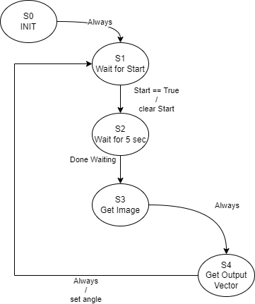
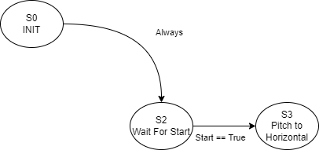

# ME_405_term_project

<h1>Learn By Dueling</h1>

Authors: Jason Davis, Adam Westfall, Conor Fraser

<h1>Overview:</h1>

The ME 405 Term Project consisted of altering a manually operated toy NERF dart gun into a automated heat seeking turret.
We were tasked with implementing a targetting, aiming, and firing system that would allow our turret to eliminate an enemy before the enemy eliminated us. 
The winner of the duel would be the first turret to land a "hit" on the opponent across a long table.
The first five seconds of the bout would be a period of movement where each human target could move back and forth between the edges of the table.
The second five seconds of the bout would be a frozen period where each human target was required to stand still.
Any missed shots would count against the turret and any repeated shots after the first hit would count for nothing.
The goal was to create an automatic sniper turret that would fire once and hit the target in the quickest time possible.
This turret can be used to entertain kids, teens, adults, and engineers.

<h1>Hardware Design:</h1>

Figure 1. Shows the front view of the physical system.

Figure 2. Shows a side view of the physical system.

Figure 3. Shows another side view of the physical system.

Our design focused on reliability, speed, and precision.
We utulized the entire allotted physical space to create a stable platform rated for the large interia's being shifted.
The following parts list contains the major components that dictated our hardware design.

<h1>Hardware Parts List:</h1>

1.	Electronically Actuated Dart Gun
2.	Gun Magazine
3.	24V DC Motor used for Yaw control
4.	24V DC Motor used for Pitch control
5.	Emergency Stop Button
6.	Start/Stop/Reset Button
7.	Indicator LED's
8.	Lazy Susan Turn Table
9.	Baseplate
10.	A-Frame Support
11.   Underside Electronics

The Electronically Actuated Dart Gun uses a design similar to a baseball pitching machine.
Two drums spun by a 12V DC motor grip onto a foam dart and accelerate it to a speed acceptable for firing.
These motors run constantly when the gun is in use, which confirms a bullet will be fired if actuated.
To adjust the default gun for the duel, auxillary power and data cords were wired through a drilled hole in the base of the handle and soldered to the necessary connections. 
This allowed us to start and stop the gun motors as well as interact with the plunger based firing system without using the gun's physical buttons.

The default gun relied on a belt fed rotating drum to supply the rollers with ammunition.
The belt did not fit in the A-frame support systems so a 3D printed magazine was designed and printed.
It slides into the top portion of the nerf gun and has a clip to stay secure. 

Figure 4. Shows the CAD model for the Magazine.

A 24V DC motor provided the necessary speed and torque for yaw control.
Using a timing belt sourced from McMaster Carr allows the encoders on the motor to turn the motors to a consistent theta value.
Without the timing belt, setting angles such as 180 degrees would not be feasible.

A 24V DC motor was also used to provide the necessary speed and torque for the pitch control.
The pitch was also controlled by a timing belt since it allows for precise angle control.

All robotic systems are at risk for malfunction and endangerment of the user, so it is imperative to include fail safes.
An emergency stop button breaks the circuit that connects the aftermentioned yaw, pitch, and gun motors to the power supply.

To prevent the overuse of the emergency stop button, a black start/stop/reset button implemented into the control panel allows a user to safely start and stop the gun's automation.

Indicator LED's on the control panel allow a user to diagnose the power state of the nerf gun and motors.

A "lazy susan" style turntable allows the gun, A-frame, and pitch control motors to rotate without excessive friction.

The plywood baseplate measures 24"x20". 
To lower the risk of tipping or instability while in motion or firing, all the available space was used.

The A-frame style structure made of plywood supports the gun pitch motors without shaking due to its rigidty and geometry.

Figure 5. Shows the underside electronics which links the STM32 with the pitch and yaw motors, the emergency stop, the reset button, the indicator LED's, and all gun actuation.

<h1>Software Design:</h1>

The software design philsophy focuses on simplicity and effectiveness.
It is comprised of five main sections that interact to achieve control of the physical system.

**Software Components**
1.  Thermal Camera
2.  Yaw Control
3.  Pitch Control
4.  Gun Actuation Control
5.  Start Button

The thermal camera allows our gun to locate targets. 
It takes a snapshot of its surrounding and then spits out a pixel array based on temperature.
Our algorithim first filters the snapshot to set all low temeprature values to zero.
Then, it runs through the remaining non-zero values to find the hottest point and its surrounding heat blob.
We can infer that the heat blob is our target.
Using the location of the heat blob and the field of view, we can extrapolate a physical 3D location of our target.
This is then sent to our yaw and pitch controllers.

Figure 6. Shows the Thermal Camera Finite State Machine Design

The Yaw and Pitch control rely on an encoder tick value to set the desired angles. 
Using a proportional closed loop controller, we can reach desired theta values with negligible steady state error.
The controllers take the location data from the thermal camera, convert this to encoder data and then move the motors.

Figure 7. Shows the Yaw Control Finite State Machine

Figure 8. Shows the Pitch Control Finite State Machine

The actuation of the gun involves sending a Pin high signal to the plunger system already pre-installed on the nerf gun.

Figure 9. Shows the Gun Actuation Finite State Machine

The start button begins the startup sequence for dueling.

Figure 10. Shows the Start Button Finite State Machine

For a more detailed analysis of the software, see the documentation linked [HERE](https://adamwestfall.github.io/ME_405_term_project/)

<h1>Testing and Results:</h1>

Due to unforseen serious health concerns, our project never had a full oppurtunity to combine all hardware and software.
The pitch, yaw, and Estop functionality was tested and functional.
The thermal camera image processing and distance tracking was tested and functional.
There was not an oppurtunity to combine these seperate aspects and run the system as a fully automated turret.

The Pitch and Yaw Testing can be seen [HERE](https://youtube.com/shorts/QEfIl4nILfw?feature=share)

Encoder Testing can be seen [HERE](https://youtube.com/shorts/12JScb-gdi4?feature=share)

The Thermal Camera Image Processing can be seen [HERE](https://youtube.com/shorts/f9dJt45VfJc?feature=share)

As mentioned above, proportional controllers dictated the pitch and yaw movement.
Testing different Kp values adjusted the steady state error and speed of the system.
A Kp value of 30 proved to be sufficient for our motor control.

Through trial and error, we deduced that the encoder ticks to rotation of pitch and yaw axis was....

<h1>Reccomendations:</h1>

This project requires knowledge of mechanical, electrical, and software design.

**Mechanical Design:**

Using a large base prevents issues associated with tipping or instability when the gun is being moved.
Strong supports that hold the gun and pitch motors should be a priority.
If those supports are imbalanced, wobbly, or too heavy, the motor control for both pitch and yaw can become near impossible.
Maintaining tension on any belts, gears, or belts is critical to getting reliable movement from the motors.

**Electrical Design:**
Avoid using redudant components that can potentially fail, such as switches, LED's, and buttons.
Confirm that the motor shield, stm32, and other precious hardware is never exposed to high voltage or put under high heat.
Cover all loose connections, maintain good color wiring standards, connect wires with shrink tubing or wire nuts.
Do not over engineer the interaction between the components, as simple wiring will suffice.
Keep wires short to reduce clutter.

**Software Design:**

Refrain from overcomplicating the multitasking of the code.
Focus energy and effort on the thermal camera targetting system.
The motors, encoders, and controller are straighforward and intuitive.

